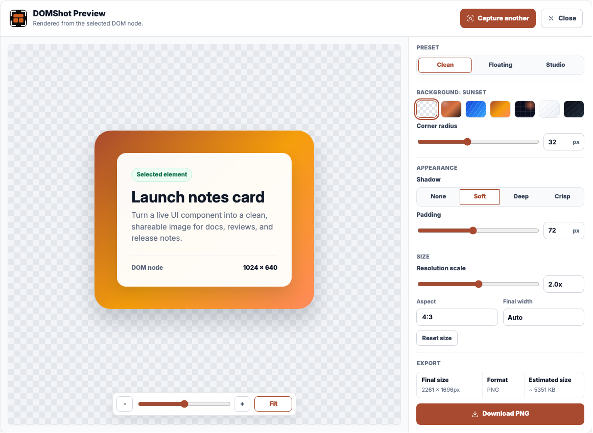
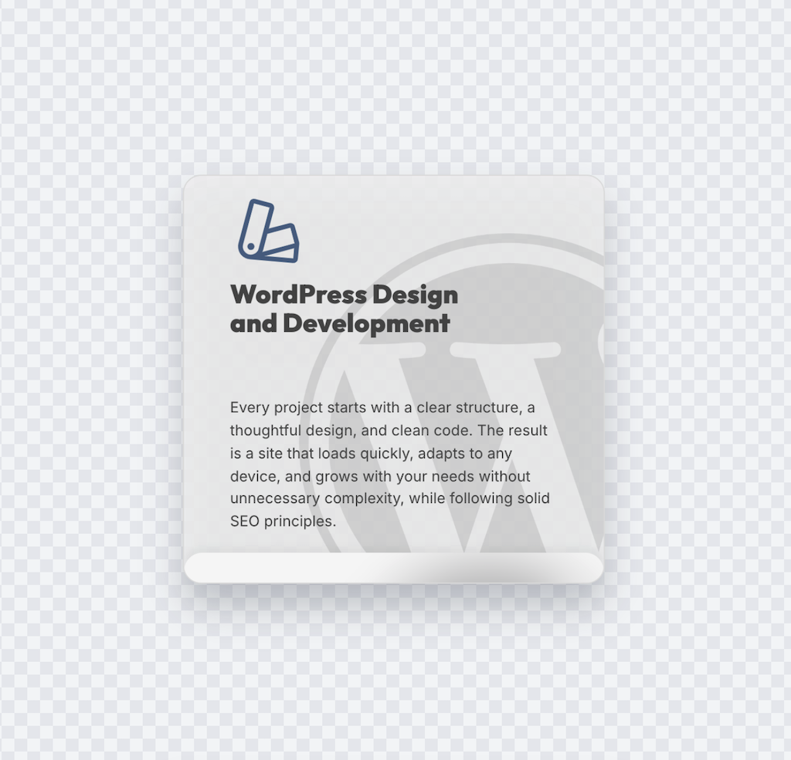

# DOMShot

DOMShot captures clean, styled screenshots of selected DOM elements, page sections, and UI components. It is built for people who want a focused visual from a webpage, and for AI agents that need reliable local screenshot tools instead of manual crop work.

Website: [domshot.app](https://domshot.app)  
Chrome extension: [Chrome Web Store](https://chromewebstore.google.com/detail/domshot/ajadoncbfggemebnplpjfejcleccaaib)  
npm package: [`@usedomshot/cli`](https://www.npmjs.com/package/@usedomshot/cli)



## What This Repo Is

This is the public technical home for DOMShot. It contains public docs, examples, support notes, privacy notes, and visual assets for understanding and using DOMShot.

The main product source repository is private. This repo is not a mirror of the private app code.

## Product Surfaces

DOMShot currently has two public surfaces:

- Chrome extension: select a visible element in the browser, preview it, style the output, and download a PNG.
- Agent package: use the Node API, `domshot` CLI, or `domshot mcp` server to inspect pages and capture polished PNGs from local automation workflows.

The agent package is useful for Codex, Claude Code, and other automation or MCP-compatible hosts that need webpage visuals as files.

## Install

For browser use, install the Chrome extension from the [Chrome Web Store](https://chromewebstore.google.com/detail/domshot/ajadoncbfggemebnplpjfejcleccaaib).

For local agent workflows:

```bash
npm install @usedomshot/cli
npx playwright install chromium
```

For global CLI and MCP use:

```bash
npm install -g @usedomshot/cli@latest
domshot --help
domshot mcp --help
```

Node.js 20 or newer is required for the agent package.

## CLI Examples

Capture an exact selector:

```bash
domshot capture https://example.com "h1" --out artifacts/domshot/heading.png
```

Capture by target description:

```bash
domshot capture https://example.com \
  --target "pricing card" \
  --out artifacts/domshot/pricing-card.png \
  --style auto
```

Inspect visible candidates:

```bash
domshot inspect https://example.com \
  --intent "homepage feature visuals" \
  --limit 6
```

Create a plan before writing final PNGs:

```bash
domshot plan https://example.com \
  --intent "homepage feature section" \
  --target "feature cards" \
  --count 4 \
  --out artifacts/domshot/homepage-plan.json \
  --style auto
```

Build a shot pack:

```bash
domshot shot-pack https://example.com \
  --intent "homepage feature section" \
  --target "feature cards" \
  --count 4 \
  --out-dir artifacts/domshot/homepage-shot-pack \
  --style auto
```

More runnable snippets live in [`examples/`](./examples).

## Output Examples

DOMShot can export the same selected element in different presentation styles:

| Clean | Floating | Studio |
| --- | --- | --- |
|  |  |  |

## MCP

Run the local MCP server with:

```bash
domshot mcp
```

Example MCP host config:

```json
{
  "mcpServers": {
    "domshot": {
      "command": "domshot",
      "args": ["mcp"]
    }
  }
}
```

Typical MCP tools include:

- `capture_domshot`
- `inspect_domshot_page`
- `recommend_domshot_shots`
- `create_domshot_plan`
- `capture_domshot_plan`
- `capture_domshot_set`
- `create_domshot_contact_sheet`
- `create_domshot_shot_pack`

Keep MCP host config stable as `domshot mcp`; update DOMShot by updating the installed npm package.

## Node API

```js
import { captureDomshot } from "@usedomshot/cli";

const result = await captureDomshot({
  url: "https://example.com",
  target: "pricing card",
  output: "artifacts/domshot/pricing-card.png",
  style: "auto"
});

console.log(result.path, result.selector, result.width, result.height);
```

## Privacy Model

DOMShot is designed around local workflows:

- The Chrome extension runs in your browser and captures the element you select.
- The agent package runs in your local automation environment.
- DOMShot does not operate a hosted screenshot service for agent captures.
- Output files, browser profiles, cookies, login state, and private page content remain in the local environment unless your own tool or host stores or shares them separately.

Read [`PRIVACY.md`](./PRIVACY.md) for the fuller public note.

## Support

Use GitHub issues for public bugs, docs gaps, and feature requests. Do not paste private URLs, cookies, tokens, browser profiles, private screenshots, or customer data into issues.

For privacy questions, contact `me@rubenruiz.dev`.

## Repository Relationship

This public repo exists so people and agents can understand DOMShot, find docs, inspect examples, and report issues. The private product repo remains the source of truth for the Chrome extension, website, package source, and release operations.
